# Network-Management-IMD
The project is used to perform the operations of the ISSD department and get all the details
regarding of the IP addresses, department name, contact information, MAC ID, Designation,
Room number, Section ID of the ISSD department. As we see usage of computers is increasing in
present trend developing this system will be very helpful for the members of the department to
communicate among themselves. This will help any user to log in( verified by the admin) and
search for any IP address. Any user residing in any corner of the world will easily be able to access
the information about the IP address.
# About
The India Meteorological Department (IMD) is an agency of the Ministry of Earth Sciences of the
Government of India. It is the principal agency responsible for meteorological observations,
weather forecasting and seismology. IMD is also one of the six Regional Specialized
Meteorological Centers of the World Meteorological Organization. It has the responsibility for
forecasting, naming and distribution of warnings for tropical cyclones in the Northern Indian
Ocean region, including the Malacca Straits, the Bay of Bengal, the Arabian Sea and the Persian
Gulf.
# Screenshots

  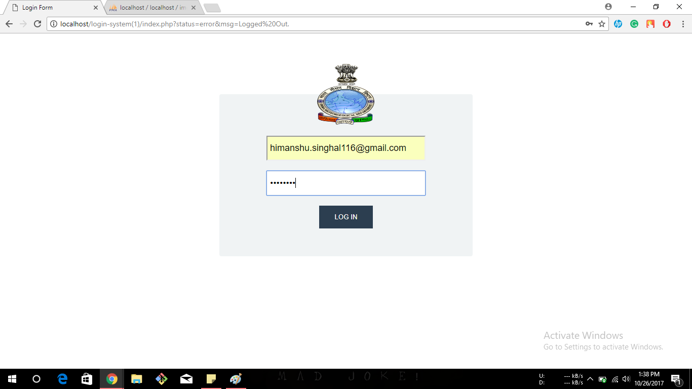&nbsp;
  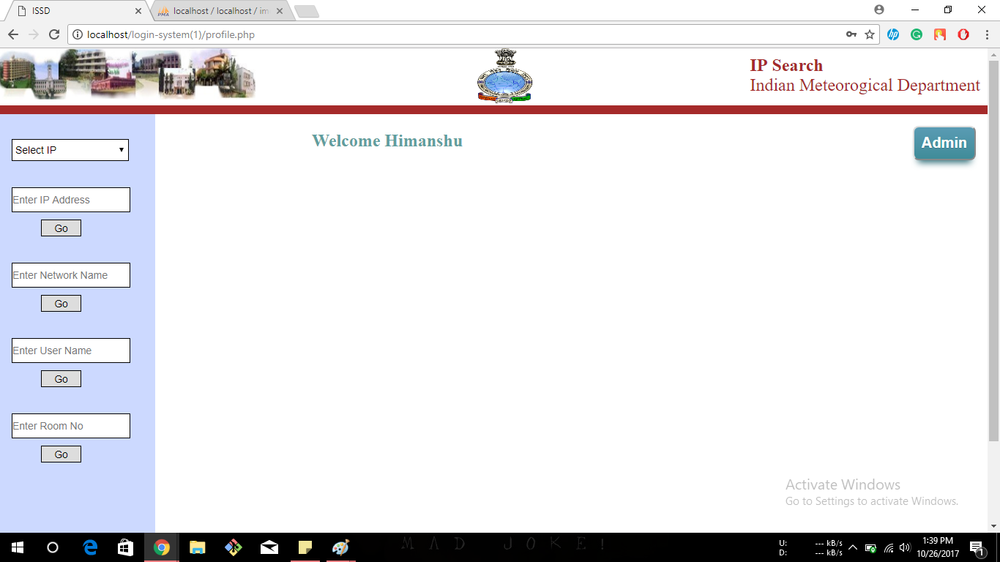&nbsp;
  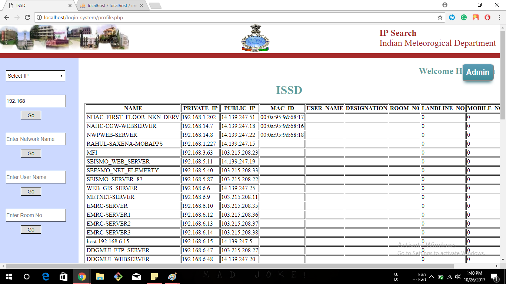

  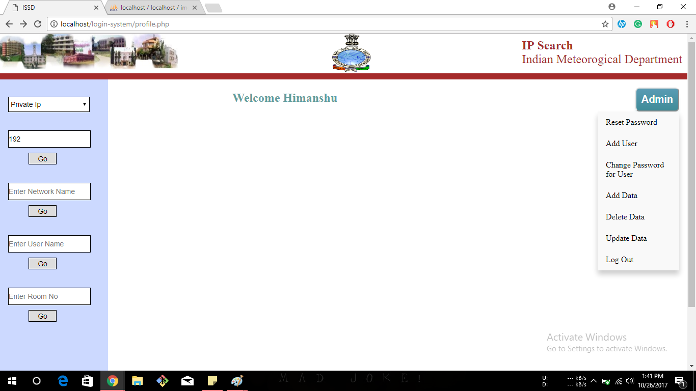&nbsp;
  &nbsp;
  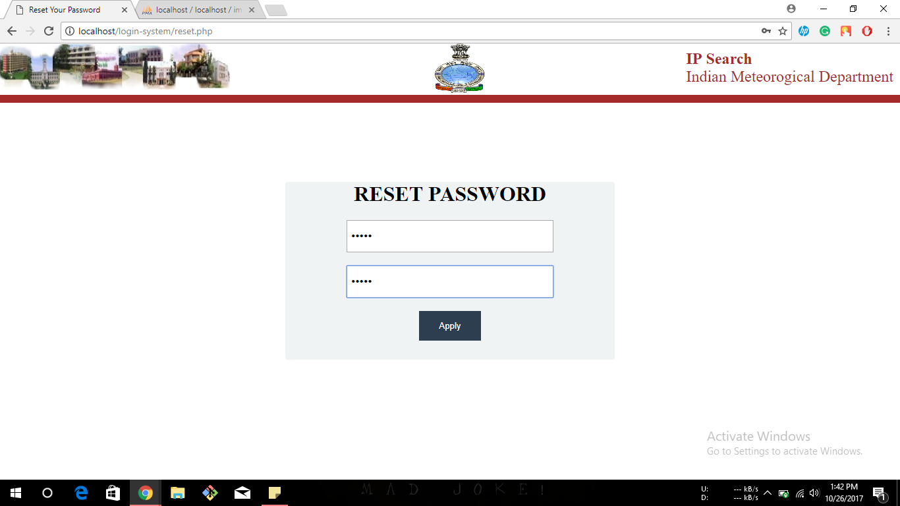

  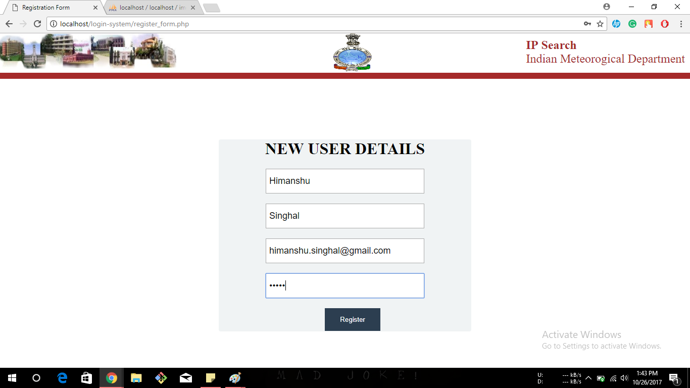&nbsp;
  &nbsp;
  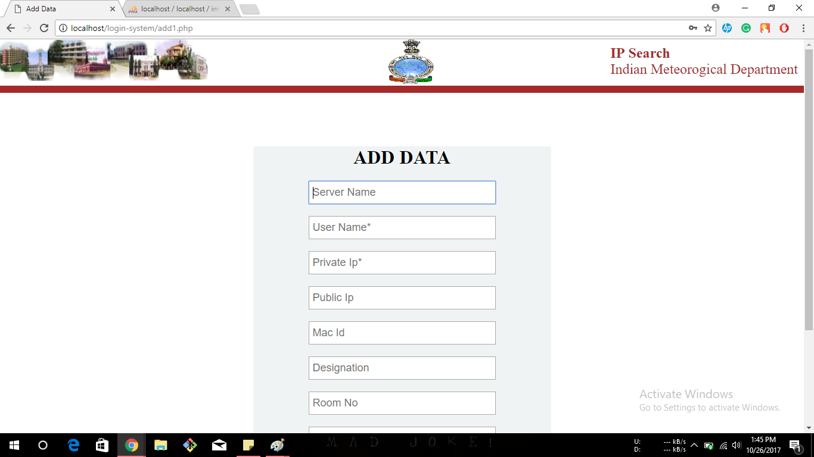

  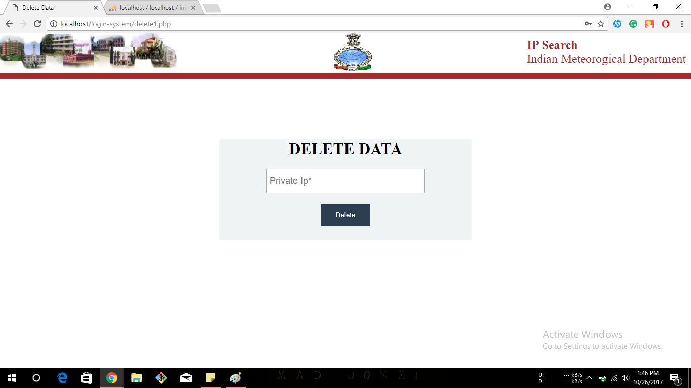&nbsp;
  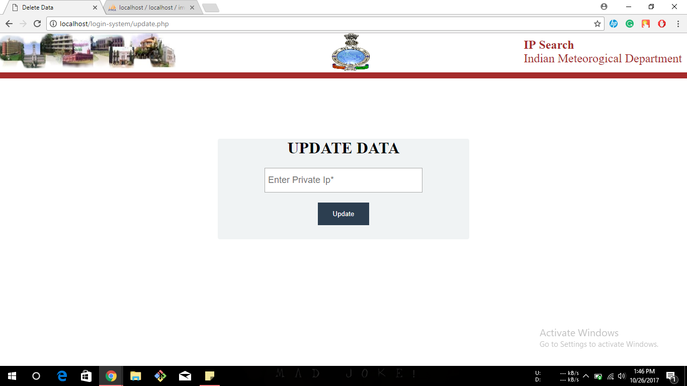&nbsp;
  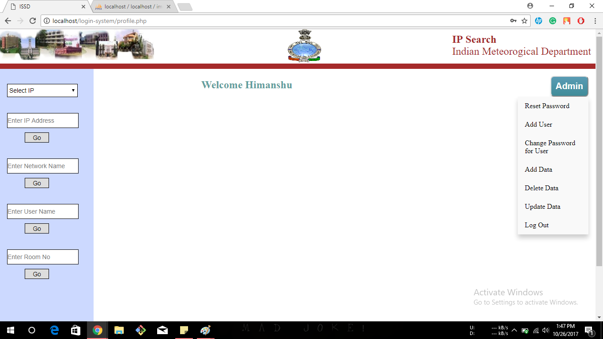

  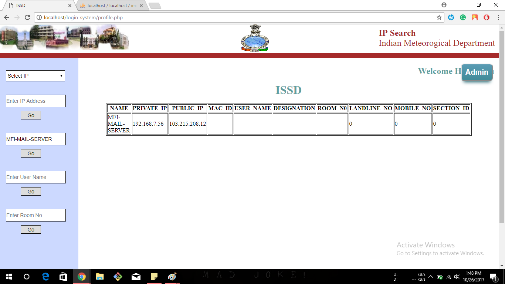&nbsp;
  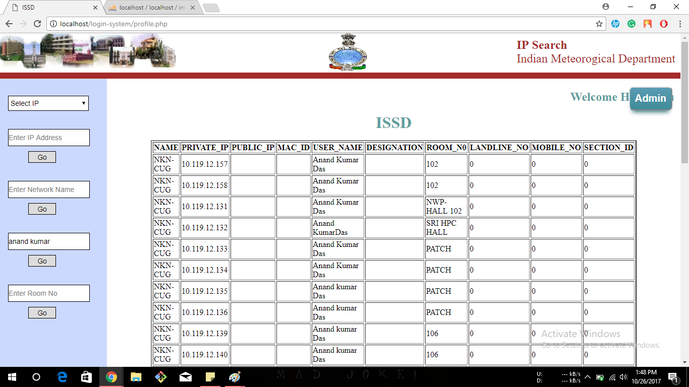&nbsp;
  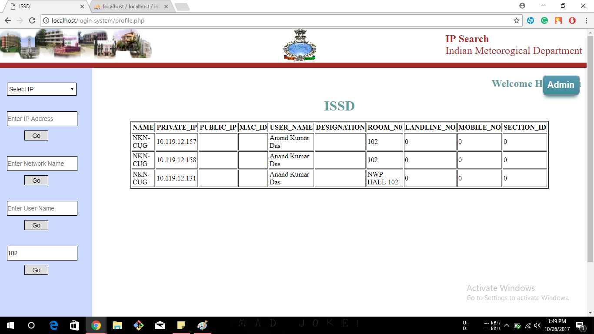

